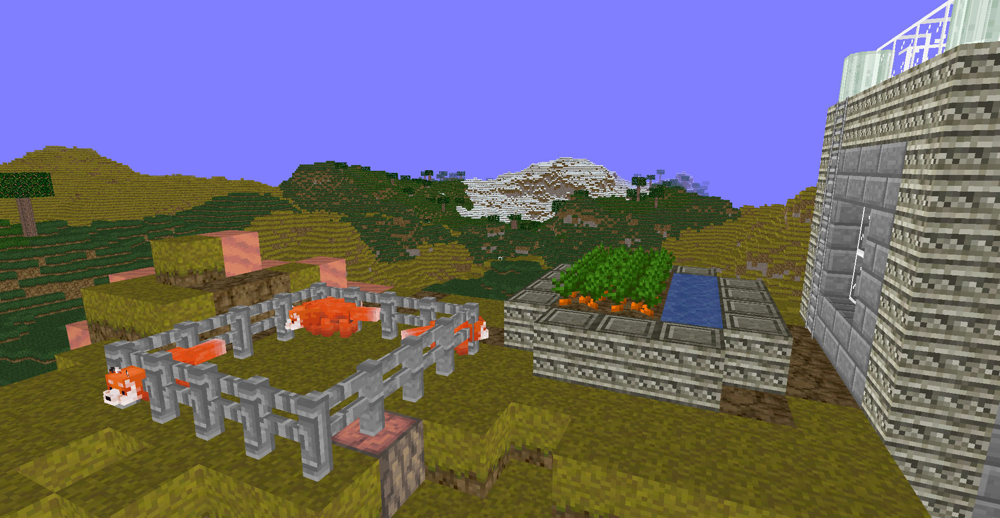
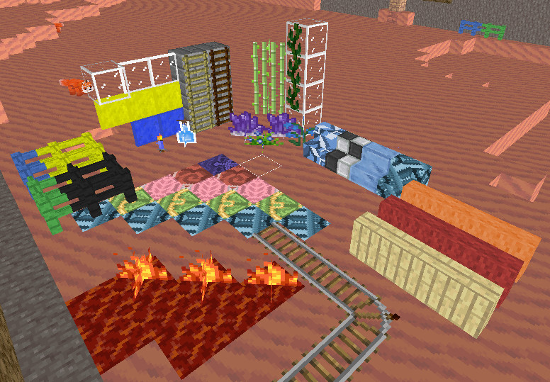
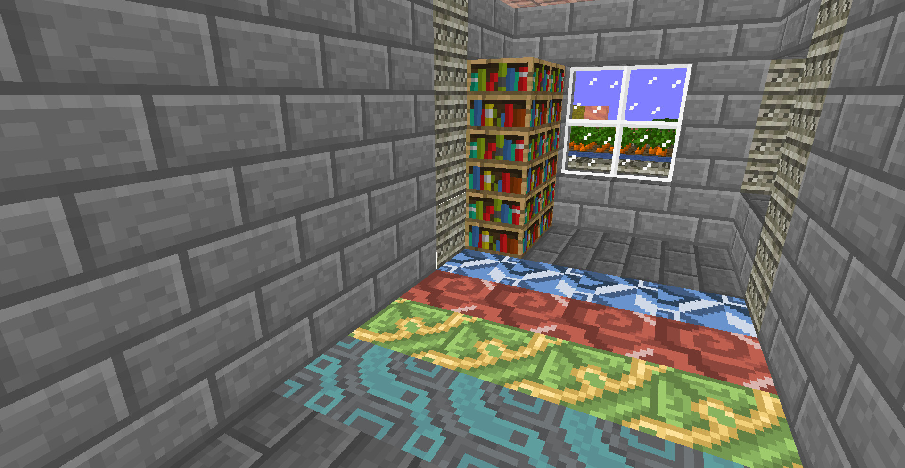
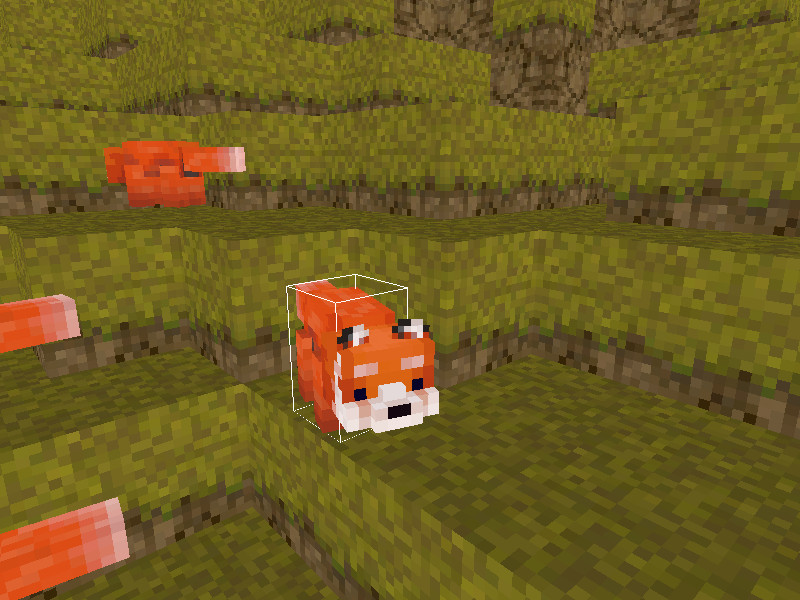
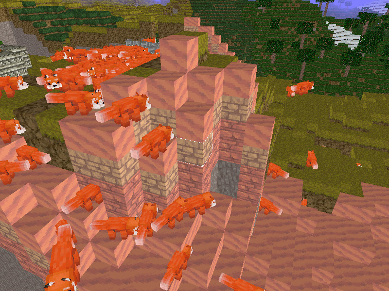
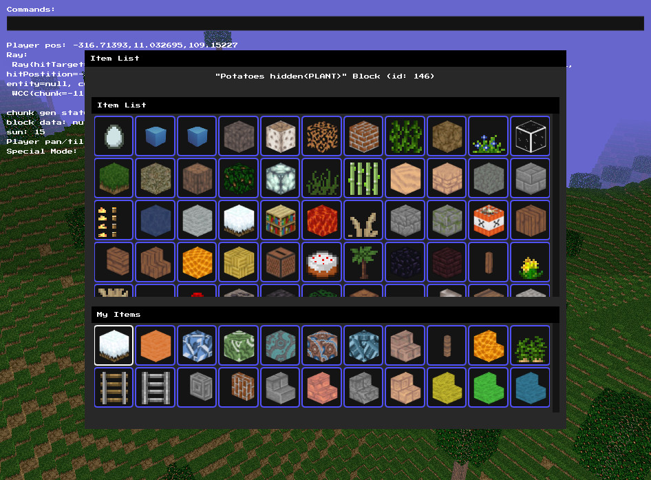

# Xbuilders 3
**A voxel game written in Java + LWJGL**

## Current features include:
* Animated blocks
* Multiple block types, including stairs, slabs, pillars, ladders, floor items (tracks, etc.) and ladders
* Entities (including animals)
  * Current entities include a Fox (animal)
* A UI main screen
* World saving/loading
* Fast chunk generation with greedy meshing
* Support for large chunk distances (up to 400 voxel radius)

## Important notes
* The JVM version must be 17. If it is higher the following message will show in output:
  * `[LWJGL] [ThreadLocalUtil] Unsupported JNI version detected, this may result in a crash. Please inform LWJGL developers.`
* I use LWJGL's Nublada GUI library that is builtin to LWJGL to do all of the UI rendering.
* Each chunk is 32x32x32 in size. Chunks coordinates are 3D
* The up direction is -Y, and the down direction is +Y
* Textures are sourced from Pixel perfection along with a few other open source minetest texture packs. Additionally, I have handcrafted a few of my own textures as well.

# Managable To-Do List towards XBuilders 2
We split the implementation features into a list of items that can be completed in a very short (~1h) time period.

## Bugfixes
* ~~(i think) when there is a null block when a chunk loads from the file, it causes some error that prevents the chunk from fully loading. instead, treat (dont replace) the unknown block like air~~
  * Pretty sure I solved this simply by returning unkknown when the item list doesnt have that block
  * However, There are probbably other instabilities that need to be fixed

## Features
* Add copy/paste tools
* Add a conversion tool from XB2 to XB3
* Player spawn position must be set in a safe place when entering the world

## Optimizations
* performance optimizations when traveling thru world

## Multiplayer
a super easy way to do multiplayer could be
* each player owns a set of chunks thay modified.
* those chunks are read only to others
* periodically, the updated chunks are all sent to other players to be loaded in world or saved on disk

# Information about features (dont delete)
## GAME BLOCK TOOLS
Here is a comprehensive list of all of the tools designed to make it faster to build:
* The block mode needs to be fast to change while also having as many features as possible
* Block mode tools and tool properties can be viewed via a dropdown menu by pressing Q

### tool parameters
A block tool has parameters. These can be toggled via hotkeys or using the dropdown menu

All block tools that use a block boudnary have 2 other parameters
* An option to toggle planar mode (make the boundary flat in X, Y or Z)
* An option to toggle the positioning of the endpoint to sit on ray hit, or ray hit+normal

## BLOCK EVENTS
* I started by allowing block types to choose how they want to exist. Certain conditions around the block would make it not allowed to be there
  * make a way for events to "shutdown" safely
  * find a way to intelligently execute block events on other threads
* when too many block events are called, it pauses the frame.
  * a solution would to be to shuttle all remaining events after the threshold limit per frame is set to a thread pool
    * I might also need to cancel/limit block set and local change events when doing it in bulk, as it would slow things down too

## WATER/FIRE/GRASS PROPAGATION WITH CELLULAR AUTOMATA
* we can use cellular autonoma interface so that the usage is essentially an abstraction of what is really going on

on a separate thread
- find a bunch of nodes to apply cellular autonoma on
- propagate using a BFS
- only the nodes that apply to said propagation process will survive
  - keep the bfs nodes separate for each process, this would also help them run at different speeds while also improving performance
- these nodes keep propagating so that we dont have to index them on each step
- if the distance from the node starting position is beyond a specific distance, index new nodes but keep the old ones
  - a node will be deleted if it is too far from player

- grass, that is dependent on the amount of time since placed, can store a timestamp in its block data?

<!---
## Keys and buttons
Key | action
--|--
W|up/fly
S|down
spacebar|jump/enable gravity
P|toggle collisions
arrow keys|move horizontally
F|toggle fast movement
M|toggle menu
ESC|leave world/exit game
I|toggle inventory
F11|save screenshot

Mouse | action
--|--
Scroll|select block
Right-click|delete block
Left-click|create block

## Overview
This game is a minecraft like block game, written in Java, with priority on **performance** and **simplicity**.

This game can run at top performance at up to a 400 voxel view radius. It has a 3d grid of chunks, The world height is limited to 255 blocks, however that is self imposed primarly due to preformance and sunlight generation in the future, and can be easily bypassed.

## Screenshots
A few of the blocks currently available

Inside a house

A group of foxes

Lots of foxes!

Screenshot of the inventory menu

Ingame screenshot:

-->
