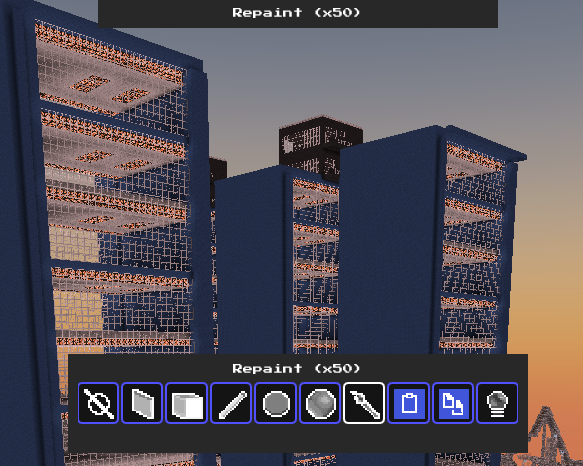

[//]: # (![tessera landscape]&#40;meta/screenshots/b.jpg&#41;)

#  Tessera
**A voxel game written in Java + LWJGL.**

# Enter a new world
Explore a variety of unique biomes, Each with unique flora and fauna!
Dig deep into a cave, discover ores to allow you to upgrade your tools and survive!
Discover animals each with their own unique AI, some can even be ridden!

Play in freeplay mode (no limits) or survival mode (limited resources, hunger, health, etc.)

|       |        |
|----------|----------|
|         |         | 
|         |        | 
|||

# Let's make building easier
tessera was built with the limitations of Minecraft in mind, If felt extremely limiting to only build one block at a time, so I decided to fix that.

Tessera comes with a variety of building tools to significantly speed up building. Use the boundary tools, copy/paste, repaint and many more to make building as easy as possible!

|||
|--|--|
|||

# Multiplayer
With LAN multiplayer, you can play with others too

Host a world for others to play or join one hosted by someone else. Anyone on your local network can play and build in your world!
<!--

-->
# All features and keybinds
## General
* LAN Multiplayer
  * Connect 2 or more computers on the same local network to play in a multiplayer setting!
  * Currently only supports LAN multiplayer (peer to peer connection) but a server client rework is in the works.
* Minecraft-like Water physics and simulation
  * 
* Torch/Sun propagation
* Day and night cycle
  * Enemies can in darkness (Adventure mode only)
* Unique biomes to explore
  * Explore and find ores in caves
* Vehicles
  * Minecarts - drive along tracks or minecart roads
  * Boats
* Hundreds of Unique blocks
  * Current block variations include Stairs, Slabs, Blocks, Fences, Ladders, Panes,  Banners, Pillars, Carpet, Rails
    * 
* Animal entities
  * current animals: Dogs, Cats, Foxes, Horses, Mule, Fish, Beavers
  * animal spawn eggs
  * Animal spawning mechanics (different animals spawn depending on the area)
  * Some animals can be ridden (horses and mules) but require a saddle first
* Random tick events
  * Crops grow
  * Amethyst crystals grow from amethyst blocks
  * Fire spreads
* Falling blocks (sand,gravel)

### General keybinds
* Change view `O`
* Sprint / Flight (Down) `Shift`
* Jump / Cancel Flight `Space`
* Place block `right mouse`
* Destroy block `left mouse`
* Flight (Up) `F`
* Open inventory `E`
* Open recipe finder `R`
* Open settings `Esc`
* commands / chat `/`

All keybinds are available under the "Help" button in the game

## Creative gameplay
* Building tools (Open the building tool menu with `Alt`)
  * 
    * Default (`1`)
    * Bounding box (`2`)
    * Plane (`3`)
    * Line (`4`)
    * Circle fill
    * Sphere
    * Repaint
    * Copy (`Ctrl+C`)
    * Paste (`Ctrl+V`)
      * Can load/save prefabs (block data) to transfer between worlds (Use in the building tool menu)
    * Light fix tool
* Toggle angel placement with `tab`
* Teleport to saved locations in the menu (Available survival, but cannot teleport to them)
## Survival gameplay
* Complete furnace, crafting table and barrels with Unique UI
* Grow crops, craft and eat food
* Defend yourself against enemies with a sword
* 3 Survival health-bars (hunger, health, air)
* View recipes in the recipe Finder (`R`)

# Check out the Wiki!
Building a voxel game was a significant challenge and came with a host of new discoveries. I have written everything that I had to do to get to a complete voxel game like this one, Bear in mind the wiki is still a work in progress, however It contains a lot of information I would have really wanted to know when building my voxel game for the first time.

# Important notes
* The JVM version must be 17. If it is higher, the following message will show in output:
  * `[LWJGL] [ThreadLocalUtil] Unsupported JNI version detected, this may result in a crash. Please inform LWJGL developers.`
* I use LWJGL's Nuklear library that is builtin to LWJGL to do all of the UI rendering.
* Each chunk is 32x32x32 in size. Chunks coordinates are 3D
* The up direction is -Y, and the down direction is +Y

# Credits
Textures from Pixel Perfection, with some handcrafted ones as well:
* https://github.com/Athemis/PixelPerfectionCE/tree/master
* https://github.com/Wallbraker/PixelPerfection?tab=readme-ov-file