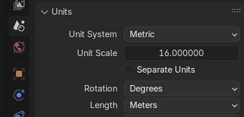
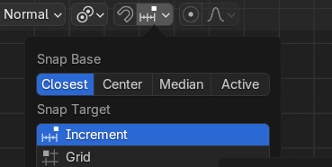
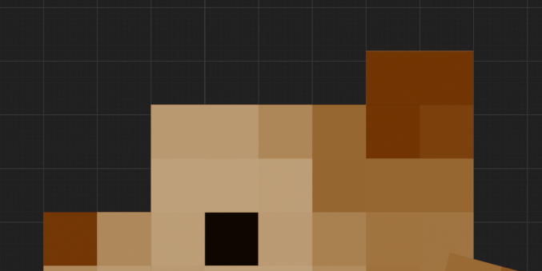

# Setting up blender
We Use blockbench to design the modela for xbuilders but we use blender to ensure that they are in the right OBJ format before loading them into xbuilders.
Use the existing "blocks and entities.blend" file to add new entities or blocks. If you want to setup your own blender file, follow these steps:

1. Set the units
   - If your texture pack is 16x, than set the units in your model to 16
   - Specify metric
   - Specify length in meters
   - 

2. In the snapping tab on the top toolbar, make sure the "snap base" is set to "closest" and "snap increment" is set to "increment"
   - 

3. Ensure that your new blockbench model aligns with the grid in blender
   - 

## Operator Preset when exporting OBJ
| property           | value    |
---------------------|------------
| Selected only      | true     |
| Triangulate meshes | true     |
| Scale              | 1        |
| Forward dir        | -Z       |
| Up dir             | -Y       |

# Making Entities
* When exporting as an OBJ, set **up direction to -Y**

# Making Blocks
* Align the block with the square bounding box in blender
* the direction that will be facing the player is -Z
* When exporting as an OBJ, set **up direction to +Y**